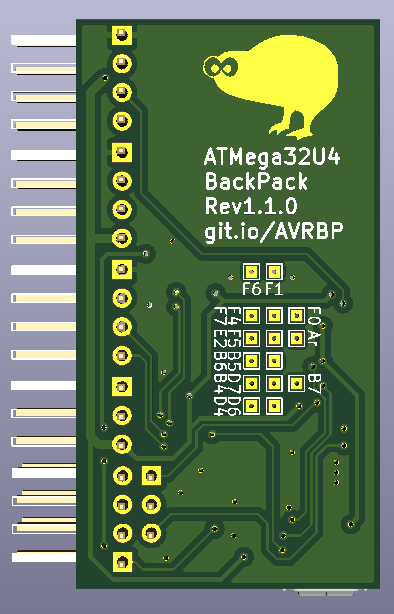

This is a small backpack PCB, meant to go with some 2.4" I2C OLED LCD. It exposes ALL pins on the ATMega32U4, so can be used for pretty much anything.

## Pinout:

| Pin | Encoder |  UART  |   I2C  | WS2812 |    SPI   |        CS3V3        |
|:---:|:-------:|:------:|:------:|:------:|:--------:|:-------------------:|
|  1  |   GND   |   GND  |   GND  |   GND  |   MISO   | 3V3 shifted IO (B0) |
|  2  |    B    | TX-3V3 |   5V   |  Data  |    3V3   |                     |
|  3  |    A    |   RX   | SCL-5V |   5V   |  SCK-3V3 |                     |
|  4  |    SW   |  5V in | SDA-5V |        | MOSI-3V3 |                     |
|  5  |         |        |        |        |   Reset  |                     |
|  6  |         |        |        |        |    GND   |                     |

The remaining pins are broken out on the back, with their port and number listed.

On the bottom is a micro-B USB.

**R4 and R5**  
Are I2C pullups. Attach these only if no other I2C device has pullups on them already.

**R6 and R7**  
Are optional pull-ups for the encoder. These can help if you have a noisy signal due to the weak internal pullups of the IC.

**Power**  
If the board is powered through the USB, the 5v power limit is 100mA, as it passes through D1. This is done to enable the chip to test if it's powered through USB or not.

```C
bool has_usb(void) {
  /* return (UDADDR & _BV(ADDEN)); */
   USBCON |= (1 << OTGPADE); // enables VBUS pad
   _delay_us(5);
   return (USBSTA & (1<<VBUS));  // checks state of VBUS
}
```



